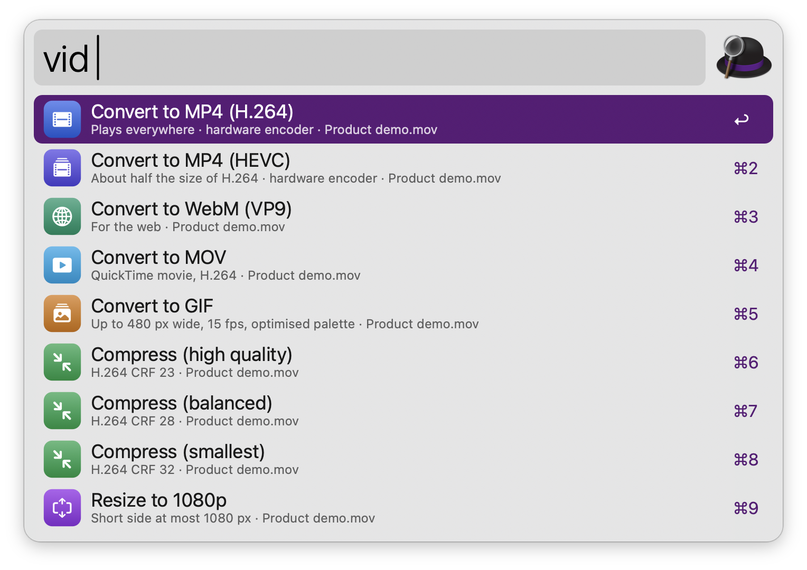
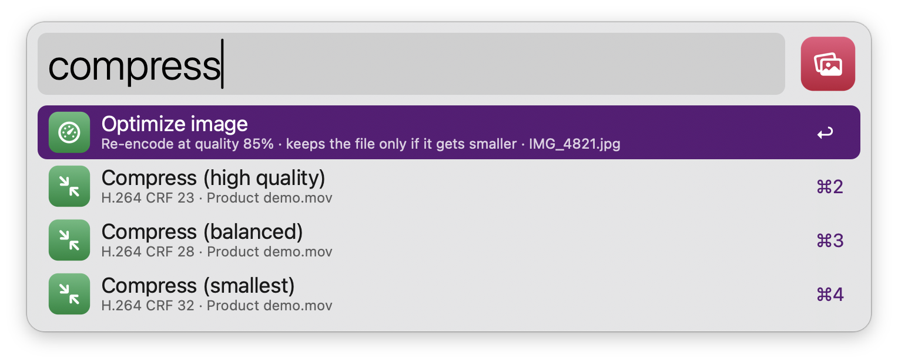

#  Media Toolkit

Resize, convert, rotate and clean images, remove backgrounds offline, and convert, compress or trim video and audio, right from the Finder selection. Images use only what ships with macOS; video and audio use ffmpeg when it's installed, and the tools built into macOS otherwise.

## Usage

Edit the images selected in Finder via the `img` keyword. Type what you want after the keyword:

* `50%` resizes by a percentage; `1200px` fits the longest side, or picks the width or height; `w800`, `h600` and `800x600` set a width, a height or a box to fit in.
* `png`, `jpg`, `heic`, `tiff`, `gif`, `bmp`, `avif` or `webp` converts. Only the formats this Mac can write are offered.
* `rotate 90`, `rotate -90`, `rotate 180` and `flip` turn or mirror the image.
* `strip` removes EXIF, GPS, camera and XMP metadata without re-compressing, and keeps the photo upright. `location` removes only the GPS data.
* `optimize` re-encodes at the quality set in the Workflow’s Configuration and keeps the result only if it is smaller.
* `background` removes the background on-device with Apple’s Vision framework (macOS 14 or later) and saves a new transparent PNG (never replacing the original), optionally cropped to the subject.


* <kbd>↩</kbd> Run the operation.
* <kbd>⌘</kbd><kbd>↩</kbd> Run the operation, then reveal the results in Finder.
* <kbd>⌘</kbd><kbd>Y</kbd> Quick Look the first selected file.
* <kbd>⌘</kbd><kbd>L</kbd> Show the selected file names.

A selected folder stands for the images, videos and audio files directly inside it.

Results are saved next to the originals with the suffix from the Workflow’s Configuration (`-edited` by default), or replace the originals if you turn that on there. Existing files are never overwritten: a number is added instead. Photos are resized and converted the way they are displayed, so EXIF rotation is respected, animated GIFs keep their frames, and transparency becomes white only in formats without an alpha channel. Colour profiles (such as Display P3), 16-bit depth and the pages of multi-page TIFFs are kept; the HDR gain map of iPhone photos is not, so edited photos are standard dynamic range. When a folder is read-only, results go to Downloads.

Convert the video and audio files selected in Finder via the `vid` keyword: MP4 (H.264 or HEVC, with the hardware encoder), WebM, MOV and GIF; extract or convert audio to MP3, M4A, WAV, FLAC or AIFF; compress; resize to 1080p, 720p or 480p; remove the audio track; or trim with `trim 0:10-0:25` (`trim 90-` keeps everything after 1:30).



Conversions run in the background, one file at a time, with a notification when they finish. While they run, the `vid` keyword shows the progress: <kbd>↩</kbd> cancels, <kbd>⌘</kbd><kbd>↩</kbd> reveals the log.

HEVC keeps HDR video in 10 bits. The other formats are 8-bit without tone mapping, so HDR clips can look washed out in some players.

Without ffmpeg, MP4, HEVC, MOV, resizing, trimming and M4A work on QuickTime and MP4 files through macOS’s own `avconvert`, and audio converts to M4A, WAV, FLAC or AIFF through `afconvert`. The other formats offer to copy `brew install ffmpeg`. ffmpeg is found in Homebrew, MacPorts and Nix locations, or set its path in the Workflow’s Configuration; formats its build can't encode are pointed out.

Alternatively, act on any files via the Universal Action, or on the Finder selection via the `media` keyword: both show the image, video and audio operations that apply, and each operation only touches the files of its kind.



Every keyword, the output suffix, the image quality and the GIF size and frame rate can be changed in the Workflow’s Configuration.

## Development

```bash
swift tools/make_icons.swift tools/icons.json src   # regenerate icons
python3 tools/build.py --package                     # write src/info.plist and dist/*.alfredworkflow
python3 tests/test_media_toolkit.py                  # run the tests (ffmpeg tests are skipped when it isn't installed)
```

## AI disclosure

This workflow was developed with the help of Claude (Anthropic), an AI assistant. The code is reviewed and tested by the author.
