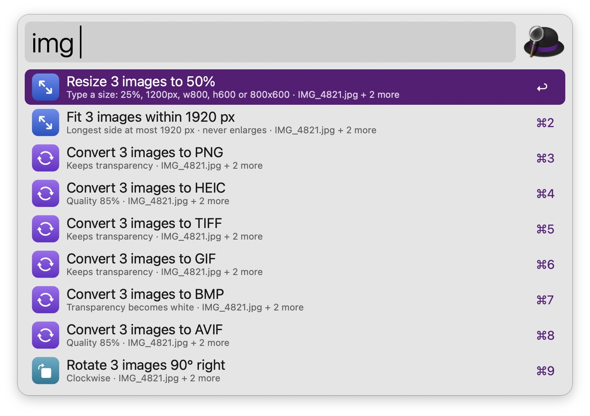

# Media Toolkit

Resize, convert, rotate, compress images and video; remove image backgrounds offline.

> **Status:** planned — not yet functional. See [PLAN.md](PLAN.md).

## Usage

Resize, convert, rotate, compress images and video; remove image backgrounds offline via the `img` keyword.



* <kbd>↩</kbd> Primary action.
* <kbd>⌘</kbd><kbd>↩</kbd> Secondary action.
* <kbd>⌘</kbd><kbd>Y</kbd> Quick Look.

Every keyword can be changed in the Workflow’s Configuration.

## Development

```bash
./build.sh   # -> dist/alfred-media-toolkit-<version>.alfredworkflow
```

## AI disclosure

This workflow is developed with the help of Claude (Anthropic), an AI assistant. All code is reviewed and tested by the author.
